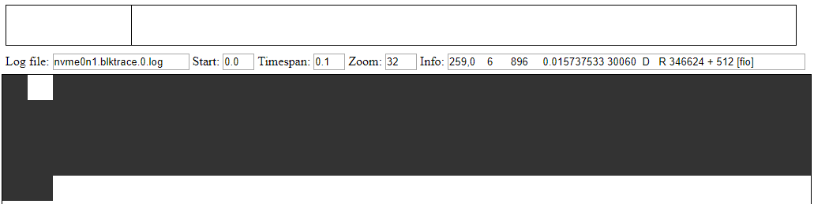

# blkviz

This is a JavaScript timeline visualizer for the output of `blkparse`. 

# Features

* Visualize block IO by block number
* Scrub through events with an interactive timeline widget
* Colors blocks as they progress through different IO stages
* Zoom in on specific time spans

# Usage

Any webserver capable of serving local files will do, such as https://github.com/lepture/python-livereload.
